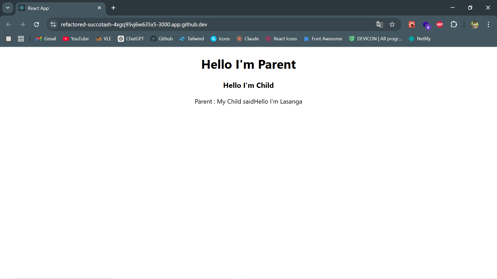

# Day07Practical

# 2020ICT35

Using state and props in a functional component design, this React practical illustrates communication between parents and children.

# Project Overview

## files

**1.App.js :** includes the parent component, which controls state and provides the child component with a callback function.
**2.ChildComp.js :** represents the kid component, which sends data back via the callback from the parent.

## Key Concepts Covered

- **State Management:** The parent's state is updated and managed using useState.
- **Props:** Data and function transmission between parts.
- **Callback functions:** allow the child component to communicate with the parent by sending data back.

## Outputs

